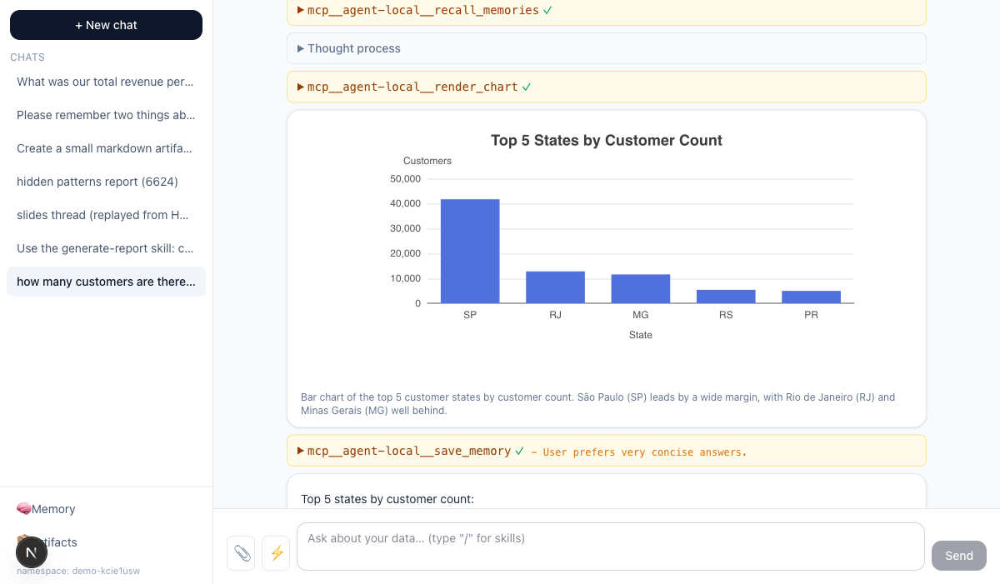
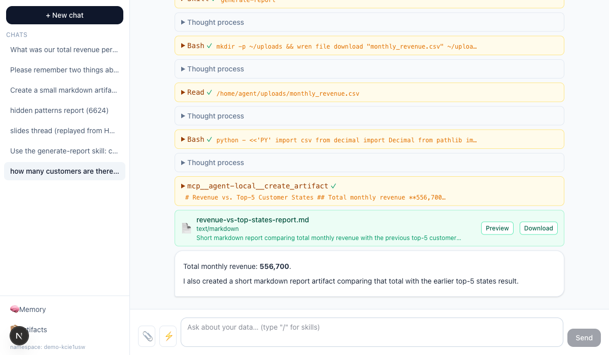
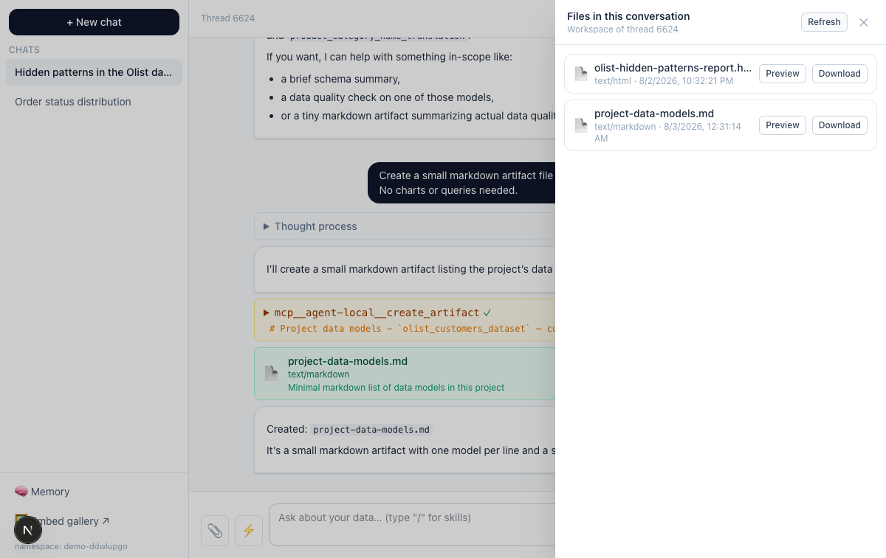
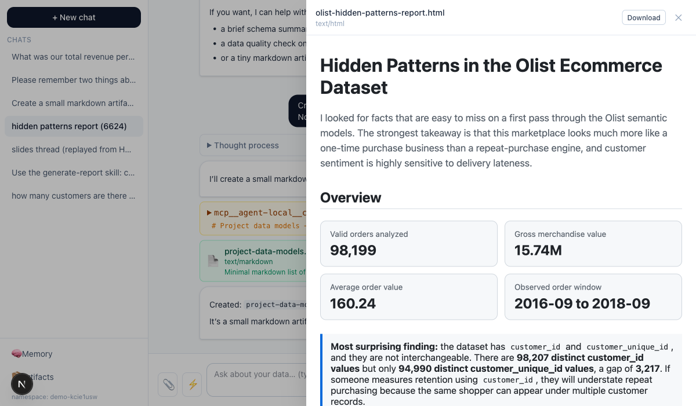
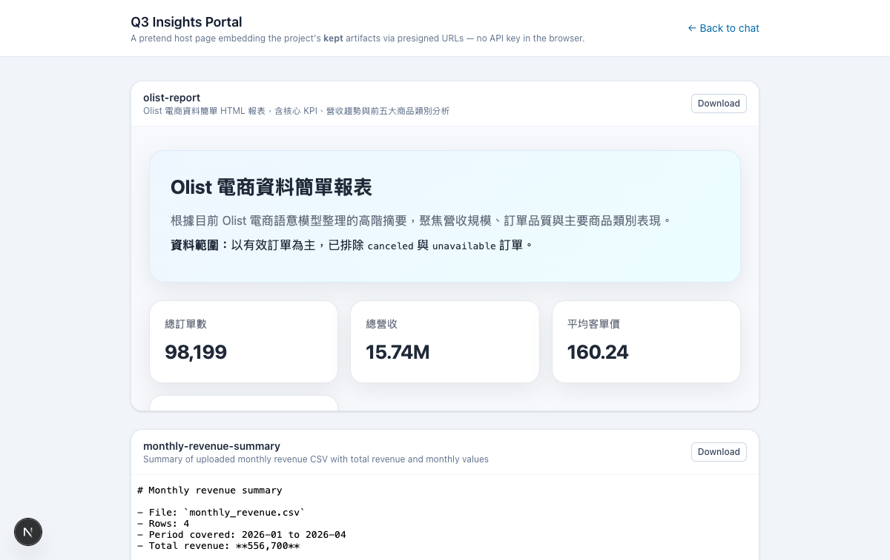
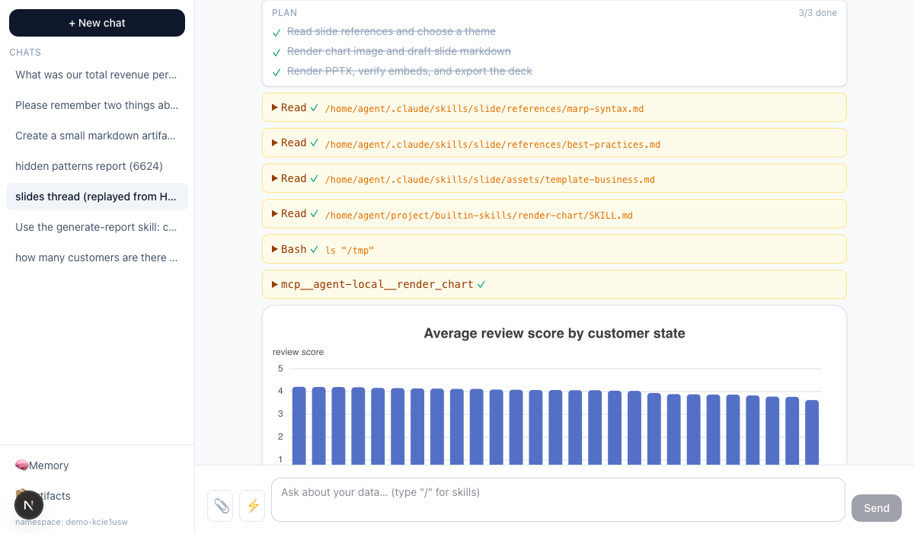
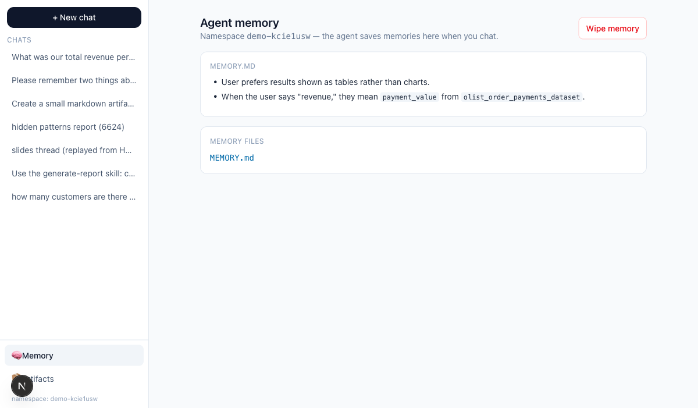
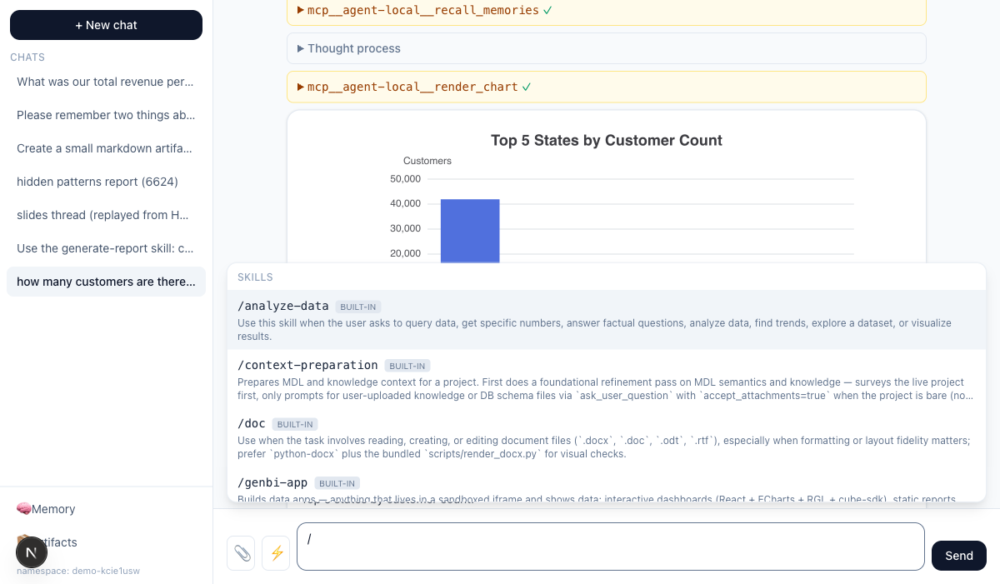

# WrenAI Agentic Mode — Example App

A complete, commented example of building a chat product on the
[WrenAI Agentic Mode API](https://wrenai.readme.io/v1.7/reference/agentic_mode):
streaming turns with live thinking and tool calls, file uploads, skills,
per-user memory, plans, and artifact preview/download.



## Quick start

```bash
cp .env.example .env.local   # fill in your project id + API key
npm install
npm run dev                  # → http://localhost:3000
```

`.env.local` needs just two values (from a WrenAI Cloud **agentic** project):

```bash
WREN_PROJECT_ID=123
WREN_API_KEY=sk-your-project-api-key
# Optional — defaults to https://cloud.getwren.ai/api/v2
# WREN_API_BASE=...
```

The API key never reaches the browser: every WrenAI call goes through a
Next.js route handler under [`src/app/api/`](src/app/api), which also pipes
the SSE stream through unchanged.

## What it demonstrates

| Feature | Where to look |
| --- | --- |
| Ask & stream a turn (thinking, tools, answer) | [`src/lib/sse.ts`](src/lib/sse.ts), [`src/lib/turnReducer.ts`](src/lib/turnReducer.ts), [`src/components/Chat.tsx`](src/components/Chat.tsx) |
| Restore a thread after reload | `Chat.tsx` — replays `GET .../result` through the **same reducer** as the live stream |
| File uploads attached to a turn | [`src/app/api/uploads/route.ts`](src/app/api/uploads/route.ts), [`src/components/Composer.tsx`](src/components/Composer.tsx) |
| New chat / thread management | [`src/lib/store.ts`](src/lib/store.ts), [`src/app/page.tsx`](src/app/page.tsx) |
| Skills list + `/` autocomplete | `Composer.tsx` |
| Per-user memory (view + wipe) | [`src/components/MemoryPanel.tsx`](src/components/MemoryPanel.tsx) |
| Plans (TodoWrite) as a live checklist | `turnReducer.ts`, [`src/components/TurnView.tsx`](src/components/TurnView.tsx) |
| Workspace files: in-chat cards + per-conversation Files drawer | `TurnView.tsx`, [`src/components/FilesDrawer.tsx`](src/components/FilesDrawer.tsx), [`src/components/PreviewPanel.tsx`](src/components/PreviewPanel.tsx) |
| Embedding promoted artifacts on another page | [`src/app/embed/page.tsx`](src/app/embed/page.tsx) — a standalone gallery using the project library + presigned URLs |
| Inline ECharts from `render_chart` results | [`src/components/EChart.tsx`](src/components/EChart.tsx) |
| Human-in-the-loop (`user_question` → `user_input`) | `TurnView.tsx` + `Chat.tsx` |
| Cancel a running turn | `Chat.tsx` → `POST .../cancellation` |

## How the API is used

| App route (proxy) | WrenAI endpoint |
| --- | --- |
| `POST /api/ask` | `POST /v2/stream/agent_ask` — SSE passed straight through |
| `POST /api/ask/{id}/user-input` | `POST /v2/stream/agent_ask/{id}/user_input` |
| `POST /api/ask/{id}/cancel` | `POST /v2/stream/agent_ask/{id}/cancellation` |
| `GET /api/turns/{id}/result` | `GET /v2/stream/agent_ask/{id}/result` |
| `GET /api/threads/{id}/messages` | `GET /v2/projects/{pid}/threads/{tid}/messages` |
| `GET /api/threads/{id}/workspace` | `GET /v2/projects/{pid}/threads/{tid}/workspace` — list a thread's files |
| `GET /api/threads/{id}/workspace/{filename}` | `GET /v2/projects/{pid}/threads/{tid}/workspace/{filename}` |
| `POST /api/uploads` | `POST /v2/projects/{pid}/uploads` |
| `GET /api/skills` | `GET /v2/projects/{pid}/skills` |
| `GET/DELETE /api/memory?ns=…` | `GET/DELETE /v2/projects/{pid}/memories/{ns}` (+ `/file`) |
| `GET /api/artifacts`, `POST /api/artifacts/{id}/url` | `GET /v2/projects/{pid}/artifacts`, `POST .../presigned-url` |
| `GET /api/proxy-file?url=…` | (helper) re-serves signed export URLs inline for previews |

## Integration notes

The details below are the things we learned building this — they're what you
need to know beyond the endpoint reference.

### The SSE stream & one reducer

`POST /v2/stream/agent_ask` streams frames: `init` first (grab `threadId` +
`threadResponseId` — nothing else in the stream carries them), then
`thinking` / `answer` in fragments keyed by `block_id`, `tool_call` /
`tool_result` **paired by their `id` field** (tools run in parallel — don't
match "latest tool"), `thinking_done` closing each reasoning segment with its
`block_id`, and a terminal `done` with token `usage`.

Everything renders through **one reducer** ([`turnReducer.ts`](src/lib/turnReducer.ts))
that consumes both the live stream and the `GET .../result` replay (events
there carry `sseEventType`). Write it once and a restored conversation looks
identical to the live one. Unknown event types must be ignored — the contract
adds new types without a version bump.

`EventSource` can't POST, so [`sse.ts`](src/lib/sse.ts) parses the stream from
a `fetch` body reader (~40 lines).

### Artifacts: workspace files vs. the project library



Every file the agent produces starts as a **workspace file** (`create_artifact`).
It is announced *only* by its `tool_result` (`{filename, content_type, …}`) —
there is no URL-minting step, the response body IS the file:

```
GET /v2/projects/{pid}/threads/{tid}/workspace              # list a thread's files
GET /v2/projects/{pid}/threads/{tid}/workspace/{filename}   # the bytes; ?mode=download for attachment
```

**This is the surface the chat app uses everywhere.** Workspace files are
scoped to one conversation, so the UI keeps them there: file cards inline in
the chat, plus a "Files" drawer in the chat header
([`FilesDrawer.tsx`](src/components/FilesDrawer.tsx)) listing that thread's
workspace. Preview whitelist: markdown, HTML, PDF — rendered in a slide-over
panel ([`PreviewPanel.tsx`](src/components/PreviewPanel.tsx)).





A file joins the **project library** only when the user asks to keep it (the
agent calls `save_artifact_to_project`). *Then* an `artifact` SSE frame fires
with a numeric `artifactId`, the file appears in `GET .../artifacts`, and
`POST .../presigned-url` mints a short-lived URL a browser can open with no
API key.

> An empty `GET /artifacts` after a turn that made files is **normal** — it
> means nothing was promoted. Look in the thread workspace.

The library is an **embedding surface**, not a chat surface — see the
[embed gallery](#embedding-promoted-artifacts-embed) below.

Separately, the **export tools** (`export_file`, `export_text`) return a
signed `download_url` in their tool result. Those URLs force
`Content-Disposition: attachment` and send no CORS headers, so this app
previews them through a tiny server proxy ([`proxy-file`](src/app/api/proxy-file/route.ts)).

### Embedding promoted artifacts (`/embed`)



[`src/app/embed/page.tsx`](src/app/embed/page.tsx) is a standalone page with
no chat UI — it plays the role of *another page in your product* (a wiki, a
KPI portal) that embeds the deliverables users asked the agent to keep:

1. List the library: `GET /v2/projects/{pid}/artifacts`
2. At **render time**, mint a presigned preview URL per artifact and point an
   ``/`<iframe>` at it — no API key in the browser, no chat context.
3. Never store the URLs: they expire in minutes. Mint on render.

### Plans (TodoWrite)



The agent tracks multi-step work with a `TodoWrite` tool. Each call re-sends
the **entire** todo list (`{content, status, activeForm}`), so the reducer
keeps a single plan block per turn and updates it in place. While the turn
streams, the app pins the plan to the top of the chat (showing the
in-progress item's `activeForm`); once finished it renders inline as a
settled checklist.

### Memory



Memory is **off unless you send `memoryNamespace`** on the ask — typically
your own end-user id (this demo generates one per browser in
[`store.ts`](src/lib/store.ts)). The agent writes memory during turns;
whatever the namespace holds is injected into its prompt at the start of
every turn with that namespace — across threads. The HTTP surface is
read + wipe only:

```
GET    /v2/projects/{pid}/memories/{ns}          # MEMORY.md + file manifest
GET    /v2/projects/{pid}/memories/{ns}/file?path=…
DELETE /v2/projects/{pid}/memories/{ns}          # GDPR wipe
```

### Skills



`GET /v2/projects/{pid}/skills` returns built-in and project skills. This app
shows them in a `/`-triggered autocomplete; picking one prefixes the question
with `Use the <name> skill: ` — routing is by plain text, there is no
"invoke skill" parameter.

### Threads & history

There is **no thread-list endpoint** — the app keeps its thread list in
`localStorage` ([`store.ts`](src/lib/store.ts)). To restore a conversation:
`GET .../threads/{tid}/messages` gives each turn's question + status; the
full content is rebuilt per turn from `GET .../result` through the shared
reducer.

### Turn lifecycle rules worth knowing

- **One turn per thread at a time** — a concurrent ask returns `409`.
- Send an **`Idempotency-Key`** on every ask; a retried request replays the
  original turn instead of billing a second one ([`ask/route.ts`](src/app/api/ask/route.ts)).
- **`user_question` keeps the stream open** — reply via the `user_input`
  side-channel with the frame's `question_id`; the turn resumes on the same
  stream. Guard against double-submits: answering the same question twice
  returns `404`.
- **All attachments for a turn must come from ONE upload request** — a
  `files` array spanning two `uploadSessionId`s is rejected with `400`.
- Allowed upload extensions: csv, doc(x), pdf, xls(x), sql, yaml/yml, md,
  json, txt, zip — max 10 files per request.

## Project layout

```
src/
  lib/
    wren.ts          server-side fetch helper (API key lives here only)
    sse.ts           SSE-over-fetch frame parser
    turnReducer.ts   events → renderable blocks (live + replay)
    store.ts         localStorage: thread list, memory namespace
    types.ts         event / block / API types
    client.ts        preview whitelist, artifact URL helpers
  app/api/           one proxy route per WrenAI endpoint (see table above)
  app/embed/         standalone gallery embedding PROMOTED artifacts (project library)
  components/
    Chat.tsx         turn orchestration: send, stream, restore, cancel
    Composer.tsx     input, attachments, "/" skills autocomplete
    TurnView.tsx     renders blocks: thinking, tools, charts, cards, questions
    PreviewPanel.tsx slide-over file preview (workspace + export files)
    FilesDrawer.tsx  per-conversation workspace file drawer (chat header)
    ArtifactPreviewModal.tsx  presigned preview for promoted artifacts
    MemoryPanel.tsx  memory view + wipe
    EChart.tsx       ECharts wrapper for render_chart specs
```
